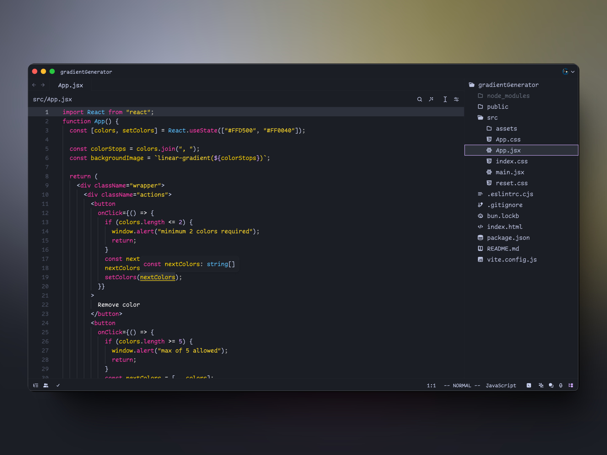

# Nstlgy Dark Theme for Zed

An elegant dark theme with vibrant syntax highlighting inspired by the integrated code playground theme created by [Josh W Comeau](https://x.com/joshwcomeau) for his [courses and blogs](https://www.joshwcomeau.com/).

## Preview

  
   
  <i>Nstlgy Dark Theme</i>
    
  
   
  <i>Nstlgy Glass Dark Theme</i>

## Installation

1. Copy `nstlgy-dark.json` to `~/.config/zed/themes/`
2. Open Zed and navigate to `Settings` -> `Theme` -> `Nstlgy Dark`

## Issues

This theme is currently under development, and syntax highlighting may not work as expected. If you encounter any issues, please let me know.

## License

This project is licensed under the MIT License.
